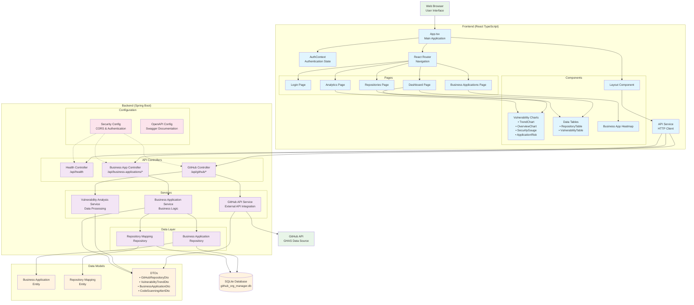

# GHAS Vulnerability Insights - Architecture Diagram

## System Architecture Overview

## Component Details

### Frontend Architecture
- **Framework**: React 18 with TypeScript
- **State Management**: Context API for authentication, React Query for server state
- **UI Framework**: Material-UI (MUI) 5
- **Charts**: Highcharts for data visualization
- **Routing**: React Router for navigation

### Backend Architecture
- **Framework**: Spring Boot 3.2.0 with Java 17
- **Architecture Pattern**: Layered Architecture (Controller → Service → Repository)
- **Security**: Spring Security with CORS support
- **API Documentation**: OpenAPI 3 (Swagger)
- **Caching**: Caffeine for GitHub API responses
- **HTTP Client**: WebFlux for reactive GitHub API integration

### Data Flow
1. **User Interaction**: User interacts with React components
2. **API Calls**: Frontend makes REST API calls via Axios
3. **Controller Processing**: Spring Boot controllers handle HTTP requests
4. **Service Layer**: Business logic processing and external API integration
5. **Data Persistence**: JPA repositories manage SQLite database operations
6. **External Integration**: GitHub API integration for vulnerability data

### Key Features
- **Single Page Application (SPA)**: React-based frontend
- **RESTful API**: Spring Boot backend with OpenAPI documentation
- **Real-time Data**: GitHub API integration for live vulnerability insights
- **Business Context**: Business application mapping and analytics
- **Security**: JWT-based authentication and CORS support
- **Responsive Design**: Mobile-friendly Material-UI components
