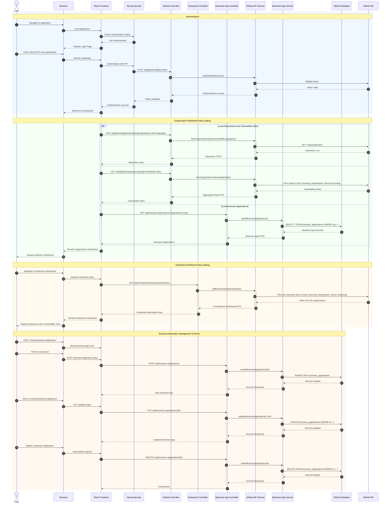

# GHAS Vulnerability Insights - Sequence Diagram

This sequence diagram illustrates the typical user interactions and data flow in the GHAS Vulnerability Insights application.

## Key Interaction Patterns

### 1. Authentication Flow
- User provides GitHub Personal Access Token
- Spring Security validates token via GitHub API
- JWT session established for subsequent requests

### 2. Data Loading Strategy
- Parallel loading of repositories and vulnerability data
- Local business applications loaded from SQLite
- Cached GitHub API responses to reduce API calls

### 3. Real-time Updates
- Periodic polling for latest vulnerability data
- WebSocket-like behavior through scheduled API calls
- User notifications for new security alerts

### 4. Business Logic Integration
- Repository-to-business-application mapping
- Local persistence for business context
- Analytics combining GitHub data with business metadata

### 5. Error Handling
- Graceful degradation for API failures
- User-friendly error messages
- Automatic retry mechanisms for transient failures

This sequence diagram demonstrates the full lifecycle of user interactions, from authentication through data visualization, highlighting the integration between the React frontend, Spring Boot backend, and external GitHub API services.
